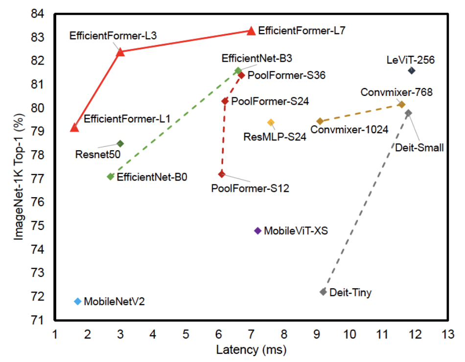
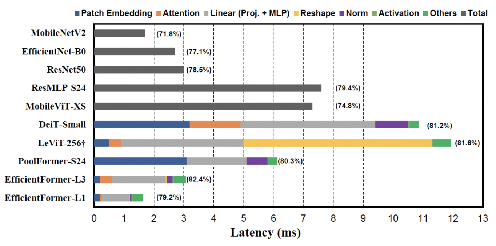
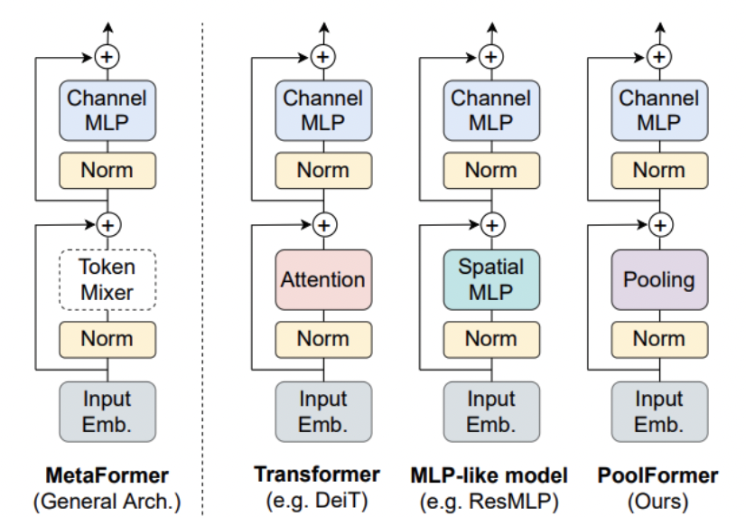
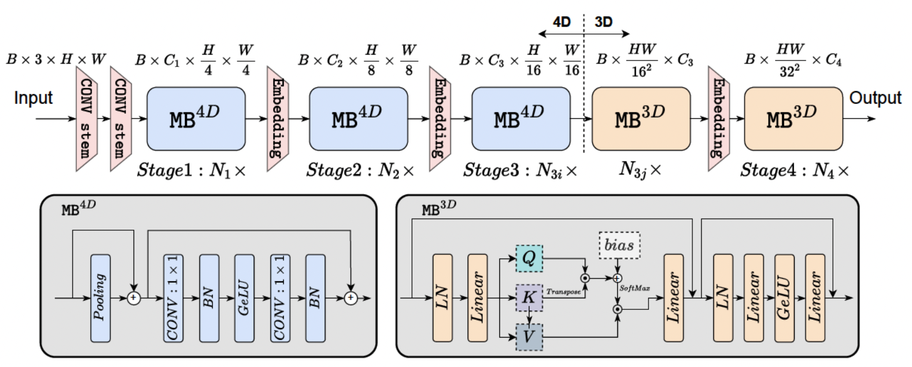
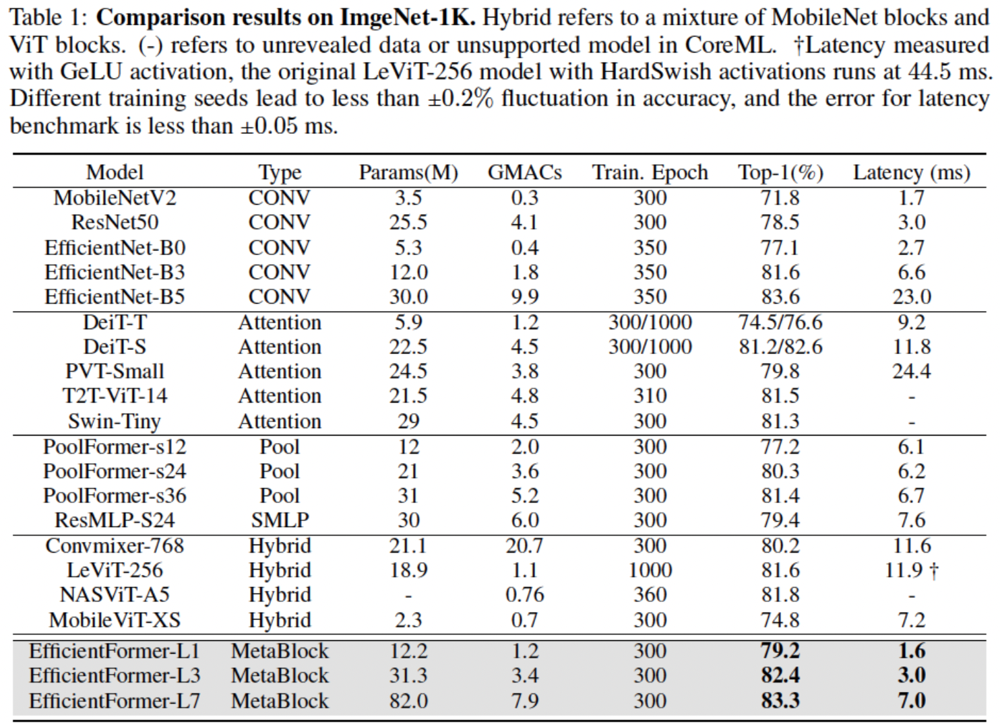
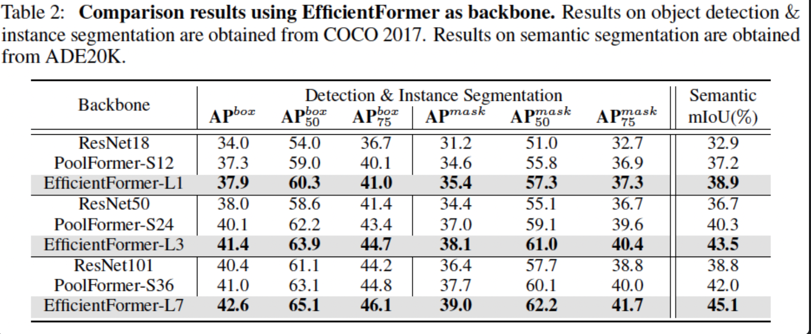

# 1. Introduction
### 주요 내용
        1. ViT가 mobilenet만큼 빨라질 수 있을까?
        2. 1번 의문점을 풀기 위해 ViT의 비효율성에 대해 분석
        3. 효율적인 dimenstion-conststent한 ViT모델 제안

        해당 논문은 FLOPs나 parameter수가 아닌 inference speed에 초점을 맞춤

# 3. On-device Latency Analysis of Vision Transformers

위 사진은 여러 모델의 latency를 iPhone12에서 측정한 결과이다. 이 실험을 통해 on-device inference speed에 악영향으 주는 요인을 분석했고, 실험 결과는 다음과 같다.

### observation 1 : 큰 kernerl과 stride를 갖는 patch embedding이 mobile device의 inference speed에 악영향을 준다.
    - Patch Embedding에 일반적으로 non-overlapping conv layer가 사용됌.
    - 이 때 사용되는 큰 kernel conv는 대부분의 compiler에서 지원되지 않음
    - 또한 acceleration algorithm으로 가속화되지않음.
    - 일반적인 transformer의 patch embedding이 Inference시간을 잡아먹는 것을 확인함

### observation 2 : token mixer의 선택은 feature-consistent가 중요하고 MSHA는 주된 속도 저하의 원인이 아님.

    
    - Token mixer란 위 사진 처럼 token간의 정보를 섞는 일종의 모듈을 의미함
    - 이 때 MSHA 자체가 아닌 그 안에 쓰인 reshape operation이 속도 저하를 일으킨 것을 확인
    - reshape operation을 거의 사용하지 않는 deminsion-consistent network 제안

### observation 3 : Conv-BN이 LN-Linear보다 latency-favorable하고 Conv-BN을 사용했을 때 성능 저하가 acceptable(받아들일만하다?)함

### observation 4 : 활성화 함수의 latency는 hardware와 compiler에 의존적
    - ReLU 대신 GeLU사용

# 4. Design of EfficientFormer

### 4.1. Dimension-consistent Design

위 사진과 같이 4D와 3D partition을 나누어 수행해 reshape 연산을 최소하시킴.
        
        - 4D partition : Conv-net과 token mixer로써 pooling layer
        - 3D partition : Linear projection과 token mixer로써 MSHA

### 4.2. Latency Driven Slimming
        - supernet을 사용해 architecture search

# 5. Experiments and Discussion

### 5.1. Image classification

        
    - 위 실험은 iPhone12에서 1000번 inference한 평균 결과임
    - 제안 논문이 FLOPs는 크나 성능이 높고 latency가 상대적으로 작음을 확인

### 5.2. EfficientFormer as Backbone

    - 제안 논문을 backbone으로 사용해 Mask-RCNN에 combine
    - COCO-2017 dataset에 적용
    - backbone으로써 detection과 segmentation에도 높은 성능을 보임과 동시에 확장성도 보여줌.

