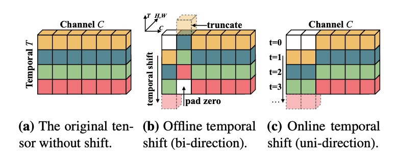
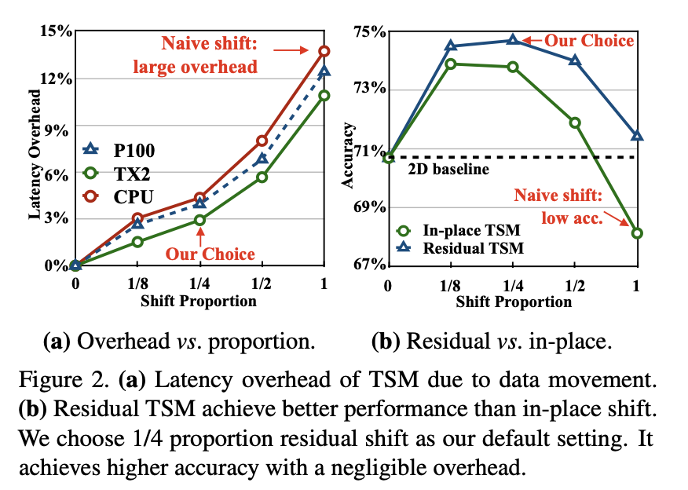
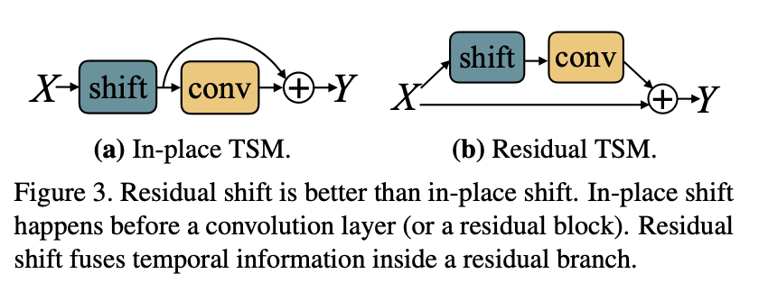

 # Abstract
   Video understanding task에서 높은 정확도와 낮은 계산량은 도전과제로 키워지고있다. 2D CNN은 계산량이 적지만 temporal information을 활용하지 못한다는 단점이 있고, 3D CNN은 계산량이 많다는 단점이 있다. 이 논문에서 우리는 높은 효율성과 성능을 낼 수 있는 Temporal Shift Module을 제안한다. 이 모델은 2D CNN에 삽입되어 계산량과 파라미터 없이 temporal modeling이 가능하게 하여 2D 모델의 계산량과 3D 모델의 성능을 낼 수 있게 한다. 

# Introduction
   본 논문의 기여는 다음 네 가지로 요약된다.

      1. 추가적인 계산량없이 시공간적 모델링이 가능하게 하는 temporal-shift라는 새로운 관점을 제시한다.
      2. navive shift는 모델 개선이 될 수 없음을 관찰했고 partial shift와 residual shift를 제시해 높은 효율성의 모델 디자인이 가능하게 한다.
      3. offline video understanding을 위한 bi-directional TSM을 제안한다.
      4. online video understanding을 위한 uni-directional TSM을 제시한다.

# Related Work

### 2.1. Deep Video Recognition
   1. 2D CNN
      - 2D CNN의 사용은 Video Recognition을 곧바로 하는 방법이다.
      - 2D CNN은 3D 방식에 비해 효율적이지만 시간적인 모델링을 할 수 없다.
   2. 3D CNN
      - 3D CNN은 시공간적 모델링이 가능하다.
      - 2D CNN에 비해 무겁고 파라미터 수가 많으며, 오버피팅이 더 잘되는 경향이 있다.
  
### 2.2. Temporal Modeling
   - 시간적인 모델링을 할 수 있는 직접적인 방법은 3D CNN을 사용하는 것이다.
   - 3D CNN의 대안은 2D CNN 이후 사후모델을 결합하는 것이다.
   - 이 경우 attention 메커니즘도 시간적인 모델링에 효율적이다.

### 2.3. Efficient Nueral Networks
   - 최근 자동으로 효율적인 아키텍쳐를 찾는 2D CNN 연구가 소개되고있다.
   - 가지치기를 위한 다른 방법은 양자화와 압축이다
   - Address Shift는 하드웨어 친화적이며 이미지 인식 모델의 소형 2D CNN 설계에도 활용되었다.
   - 그럼에도 우리는 shift 연산을 직접적으로 video recognition 모델에 삽입하는 것은 효율성과 성능을 고려하지 않다는 것을 알아냈다.

# 3. Temporal Shift Module(TSM)
   - 먼저 TSM에 대해 설명한다 -> 데이터의 움직임과 연산은 convolution에서 분리될 수 있다.
   - 그러나 우리는 naive shift 연산이 높은 성능과 효율을 달성하지 못한다는 것을 알아낸다.
   - 이러한 문제 해결을 위해 데이터 이동을 최소하하고 모델 용량을 늘리는 두 가지 기술을 제안한다.

### 3.1. Intuition

위 사진처럼 시간 차원 축을 기준으로 각 채널 차원의 데이터를 shift 시킨다. (b)와 (c)는 각각 Offline과 online 학습을 위한 모듈이며, online의 경우 미래 시점 쪽으로만 shift되는 것을 알 수 있다.

### 3.2. Navie Shift Does Not Work
   제안 모듈의 간단한 원리에도 불구하고 시간차원에 직접적인 공간적 shift 적용이 높은 성능과 효율을 만들 수 없다는 것을 알아냈다. 구체적으로 모든 채널을 shift했을 때 다음과 같은 두 가지 악영향이 발생한다.

   1. 큰 데이터 이동으로 인한 안 좋은 효율성
   2. 공간적 모델링 능력 저하로 인한 전체 성능 저하

### 3.3 Module Design
   위 두 가지 문제를 피하기 위해 다음과 같은 두 가지 기여에 대하 논의한다.

   1. Reducing Data Movement
   
  

      - data movement의 영향을 측정하기 위해 다음과 같은 실험을 진행했다.
      - 여러 하드웨어 환경에서 Resnet-50을 backbone으로 하는 TSM을 구성한다.
      - 다른 비율의 채널을 shift하고 latency를 측정한다.

   2. Keeping Spatial Feature Learning Capacity

   

      - 그림의 In-place TSM처럼 shift모듈을 삽입했을 때, 공간적 특징 학습 용량에 악영향을 준다.
      - 이 문제를 해결하기 위해 residual block에 변종 shift 모듈을 삽입했다.
      - 비교 실험 결과 Figure2 (b)에서 확인 가능

# 4. TSM Video Network

### offline Models with Bi-directional TSM
   

   

   

    
